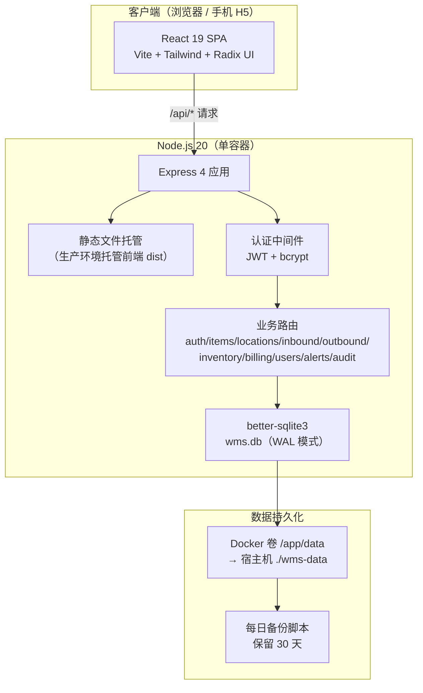
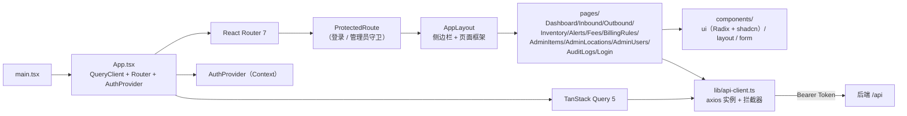
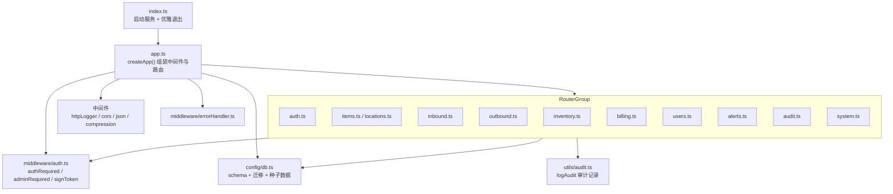
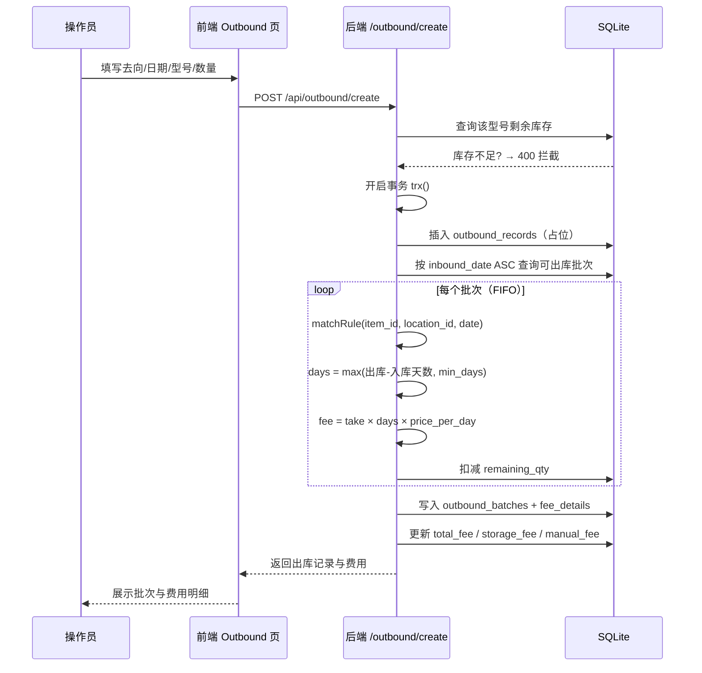
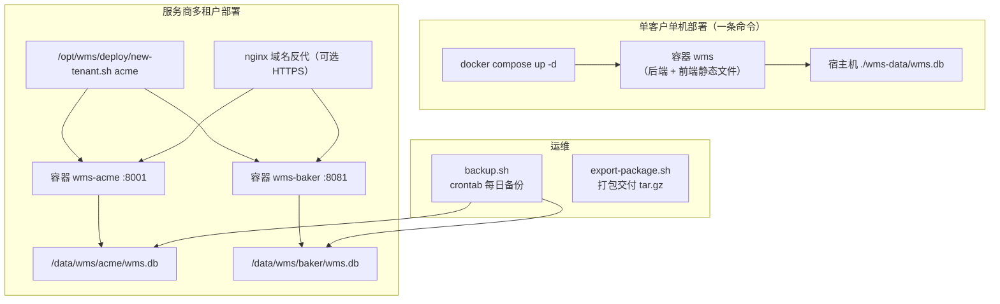

# 智慧仓储管理系统（WMS）系统架构

> 文档版本：v1.0　|　更新日期：2026-08-30

---

## 1. 总体架构

系统采用 **前后端分离 + 单容器一体化部署** 的架构：开发期前后端独立运行（Vite Dev Server + Express），生产期由后端托管前端静态文件，打包进单个 Docker 镜像，实现"一条命令交付"。



---

## 2. 前端架构



**分层职责：**

| 层 | 目录 | 职责 |
| --- | --- | --- |
| 页面层 | `src/pages/` | 路由页面，编排业务逻辑 |
| 组件层 | `src/components/` | UI 组件（ui / layout / form / 业务组件） |
| 状态层 | `src/hooks/` | `use-auth`（认证状态）、`use-mobile` |
| 数据层 | `src/lib/api-client.ts` | axios 实例、拦截器、错误处理 |
| 类型层 | `src/types/` | TypeScript 类型定义 |

---

## 3. 后端架构（模块化）



---

## 4. 数据流（出库计费核心链路）



---

## 5. 部署架构



**关键点：** 每个客户 = 独立容器 + 独立数据库文件 + 独立随机 JWT 密钥，物理隔离、零数据交叉。

---

## 6. 目录结构

```
AI智慧仓储助手/
├── backend/                 # 后端（Express + TypeScript + SQLite）
│   ├── src/
│   │   ├── app.ts           # 应用组装（中间件 + 路由 + 静态托管）
│   │   ├── index.ts         # 启动入口
│   │   ├── config/          # env / db / logger
│   │   ├── middleware/      # auth / errorHandler / logger / validation
│   │   ├── modules/         # 业务路由（按领域拆分）
│   │   ├── types/           # 类型定义
│   │   ├── utils/audit.ts   # 审计工具
│   │   └── __tests__/       # Jest 测试
│   └── public/              # 生产环境托管的前端构建产物
├── frontend/                # 前端（React 19 + Vite）
│   └── src/
│       ├── pages/           # 路由页面
│       ├── components/      # ui / layout / form
│       ├── hooks/           # use-auth / use-mobile
│       ├── lib/             # api-client / utils
│       └── types/           # 类型定义
├── deploy/                  # 部署脚本（new-tenant / export-package / backup）
├── docs/                    # 项目文档
├── Dockerfile               # 多阶段构建（单容器一体化）
└── docker-compose.yml       # 客户单机交付配置
```
