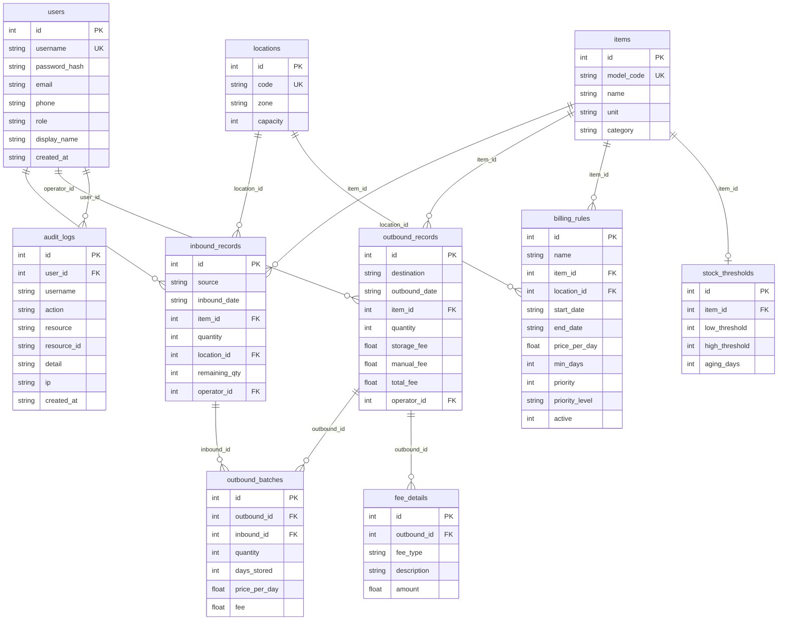

# 智慧仓储管理系统（WMS）实现说明

> 文档版本：v1.0　|　更新日期：2026-08-30

本文档描述系统的具体实现，包括数据模型、核心代码逻辑与运行方式。

---

## 1. 数据模型（ER 关系）



### 关键表说明

| 表 | 作用 |
| --- | --- |
| `inbound_records` | 入库记录，`remaining_qty` 追踪剩余可出库数（FIFO 扣减依据） |
| `outbound_records` | 出库主记录，汇总存储费/人工费/总费 |
| `outbound_batches` | 出库-入库批次关联，记录每批数量、天数、单价、费用 |
| `billing_rules` | 计费规则，`item_id`/`location_id` 可空表示"通用" |
| `fee_details` | 费用明细，按 `fee_type`（storage/labor/extra）分类 |
| `stock_thresholds` | 每物品的预警阈值 |
| `audit_logs` | 操作审计，含 user/resource/action/detail |

---

## 2. 核心代码实现

### 2.1 应用组装（`app.ts`）

```ts
export const createApp = (): Application => {
  const app = express()
  app.use(httpLogger)                 // pino HTTP 日志
  app.use(cors({ ... }))              // CORS
  app.use(express.json({ limit: '20mb' }))
  app.use(express.urlencoded({ extended: true, limit: '20mb' }))
  app.use(compression())

  // 注册业务路由
  app.use(env.API_PREFIX, systemRouter)
  app.use(`${env.API_PREFIX}/auth`, authRouter)
  app.use(`${env.API_PREFIX}/items`, itemsRouter)
  // ... 其余路由

  // 生产环境托管前端静态文件（单容器部署）
  const publicDir = path.join(process.cwd(), 'public')
  if (fs.existsSync(publicDir)) {
    app.use(express.static(publicDir, { maxAge: '7d', index: false }))
    app.get(/^\/(?!api).*/, (_req, res) => res.sendFile(path.join(publicDir, 'index.html')))
  }

  app.use(errorHandler)
  return app
}
```

### 2.2 出库计费核心（`outbound.ts`）

**规则匹配函数**（四级层级 + 同层取最新）：

```ts
function matchRule(itemId, locationId, outboundDate): BillingRule {
  const q = `
    SELECT * FROM billing_rules
    WHERE active=1
      AND (start_date IS NULL OR start_date <= ?)
      AND (end_date IS NULL OR end_date >= ?)
      AND (item_id IS NULL OR item_id = ?)
      AND (location_id IS NULL OR location_id = ?)
    ORDER BY
      (CASE WHEN item_id IS NOT NULL AND location_id IS NOT NULL THEN 3
            WHEN item_id IS NOT NULL THEN 2
            WHEN location_id IS NOT NULL THEN 1
            ELSE 0 END) DESC,
      id DESC
    LIMIT 1`
  return db.prepare(q).get(outboundDate, outboundDate, itemId, locationId)
    || { id: 0, price_per_day: 0.5, min_days: 1 }  // 默认规则
}
```

**出库事务流程**：

```ts
const trx = db.transaction(() => {
  // 1. 插入出库主记录（占位）
  const outboundId = Number(
    db.prepare(`INSERT INTO outbound_records (...) VALUES (...)`)
      .run(...).lastInsertRowid
  )

  // 2. FIFO 查询可出库批次
  const inbounds = db.prepare(
    `SELECT * FROM inbound_records WHERE item_id=? AND remaining_qty>0
     ORDER BY inbound_date ASC, id ASC`
  ).all(itemId)

  // 3. 逐批扣减并计费
  for (const ib of inbounds) {
    const take = Math.min(need, ib.remaining_qty)
    const rule = matchRule(itemId, ib.location_id, outboundDate)
    const days = Math.max(daysBetween(ib.inbound_date, outboundDate), rule.min_days)
    const fee = take * days * rule.price_per_day
    // 扣减 remaining_qty + 记录批次
  }

  // 4. 写入 outbound_batches + fee_details
  // 5. 更新 total_fee = storage_fee + manual_fee
})
```

### 2.3 审计工具（`utils/audit.ts`）

```ts
export function logAudit(req, { action, resource, resourceId, detail }) {
  db.prepare(
    `INSERT INTO audit_logs (user_id, username, action, resource, resource_id, detail, ip)
     VALUES (?,?,?,?,?,?,?)`
  ).run(req.user?.id, req.user?.display_name, action, resource, resourceId,
        JSON.stringify(detail), req.ip)
}
```

在登录、入库、出库、规则变更、用户变更等关键动作处调用，实现全链路留痕。

---

## 3. 运行方式

### 3.1 开发环境

```bash
# 后端（端口 3000，tsx watch 热重载）
cd backend && pnpm install && pnpm dev

# 前端（端口 5173，Vite 代理 /api → 3000）
cd frontend && pnpm install && pnpm dev
```

前端 Vite 已配置 `/api` 代理到 `http://localhost:3000`。

### 3.2 生产部署（单容器）

```bash
docker compose up -d
# 访问 http://<服务器IP>:8080
# 默认账号 admin / admin123（首次登录后改密）
```

### 3.3 多租户开户

```bash
cd /opt/wms/deploy
./new-tenant.sh acme          # 自动分配端口
./new-tenant.sh baker 8081    # 指定端口
```

### 3.4 测试与构建

```bash
cd backend && pnpm test       # Jest 集成测试
cd backend && pnpm build      # tsc 编译
cd frontend && pnpm build     # vite build
```

### 3.5 备份

```bash
/opt/wms/deploy/backup.sh     # 建议 crontab：0 3 * * *
```

---

## 4. 默认种子数据

系统首次启动自动初始化：

| 项 | 默认值 |
| --- | --- |
| 管理员账号 | `admin / admin123`（角色 admin） |
| 操作员账号 | `operator / operator123`（角色 operator） |
| 物品型号 | 6 个示例 SKU（五金、型材、电子、包装等） |
| 库位 | 6 个示例库位（A/B/C 区，含冷藏区） |

> 种子数据仅当对应表为空时插入，便于开箱即用演示。
