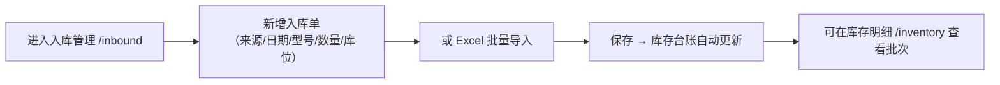

# 智慧仓储管理系统（WMS）用户使用路径

> 文档版本：v1.0　|　更新日期：2026-08-30

本文档描述不同角色从登录到完成核心业务的完整操作路径。

---

## 一、管理员：首次初始化配置路径

| 步骤 | 操作 | 入口 | 说明 |
| --- | --- | --- | --- |
| 1 | 登录系统 | `/login` | 用初始账号 `admin` 登录 |
| 2 | 修改密码 | 用户管理 → 编辑 admin | 首次登录后建议立即改密 |
| 3 | 创建账号 | `/admin/users` → 新增用户 | 为仓管员创建「操作员」账号，可绑定邮箱/手机 |
| 4 | 录物品型号 | `/admin/items` | 登记常用 SKU（型号、名称、单位、分类） |
| 5 | 规划库位 | `/admin/locations` | 按区域/货架录入库位编号、容量 |
| 6 | 设计费规则 | `/billing/rules` | 按合同录入日单价、起租天数、匹配维度 |
| 7 | 运营 | 全模块 | 后续出入库、计费、预警自动运转 |

---

## 二、操作员：日常出入库路径

### 2.1 入库流程

1. 打开【入库管理】→ 点击新增；
2. 填写来源、入库日期、物品型号、数量、存放位置；
3. （可选）大批量时点「模板下载」→ 填好后「批量导入」；
4. 保存后系统自动更新库存台账、记录批次与剩余可出库数。

### 2.2 出库流程（自动计费）

1. 打开【出库管理】→ 点击新增；
2. 选择去向、出库日期、物品型号（下拉自动关联已入库型号）、数量；
3. 系统自动按 FIFO 拆分批次、计算存放天数和存储费；
4. 需要时可录入人工费 / 附加费；
5. 保存后可在记录详情查看每笔批次小计。

---

## 三、日常监控路径

| 角色 | 路径 | 说明 |
| --- | --- | --- |
| 管理员/操作员 | `/dashboard` | 查看库存总量、出入库趋势、库位热力图 |
| 管理员/操作员 | `/alerts` | 查看 4 类预警（断货/偏低/过高/滞留） |
| 管理员 | `/alerts` → 阈值设置 | 为物品设置低/高阈值、老化天数 |
| 管理员/操作员 | `/billing/fees` | 查看费用构成，导出 Excel |
| 管理员 | `/admin/audit-logs` | 检索操作日志，审计留痕 |

---

## 四、典型业务场景

### 场景 1：第三方仓储按天计费

- 管理员设置规则：`锂电池 → A区 → ¥2/天 → 最低起租 3 天`；
- 操作员入库 100 组锂电池到 A 区；
- 7 天后出库 40 组 → 系统按 FIFO 找到对应批次，计算 `40 × 7 天 × ¥2 = ¥560` 存储费。

### 场景 2：不同客户差异化计价

- 通过多租户脚本为每个客户开独立容器 + 独立库；
- 每个客户在自己的系统里维护自己的计费规则、物品、库位，互不干扰。

### 场景 3：库存预警干预

- 某 SKU 库存低于阈值 → 预警看板出现「偏低」；
- 管理员在预警页直接看到，安排补货；
- 某批次滞留超过老化天数 → 出现「滞留过久」，提示尽快处理。

---

## 五、权限对照（快速参考）

| 功能 | 管理员 | 操作员 |
| --- | :---: | :---: |
| 登录 | ✅ | ✅ |
| 入库/出库 | ✅ | ✅ |
| Excel 批量导入 | ✅ | ✅ |
| 库存/费用/预警查看 | ✅ | ✅ |
| 计费规则维护 | ✅ | ❌ |
| 物品/库位/用户管理 | ✅ | ❌ |
| 操作日志查看 | ✅ | ❌ |
